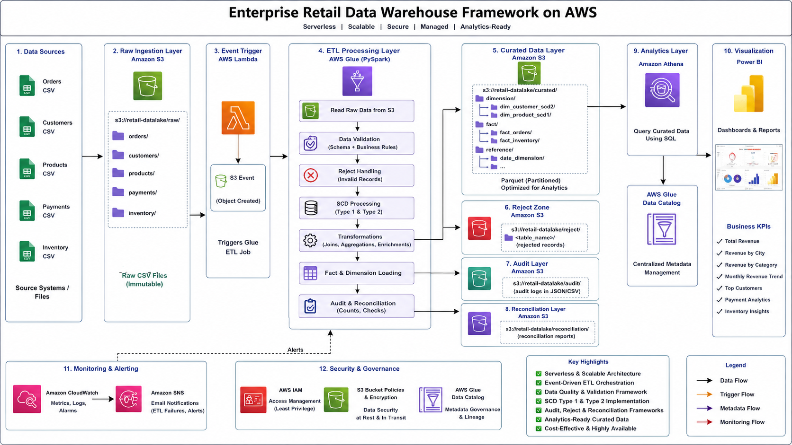

# Enterprise Retail Data Warehouse Framework on AWS

## Project Overview

Designed and implemented an enterprise-grade retail data warehouse framework on AWS using Amazon S3, AWS Glue PySpark, AWS Lambda, Amazon Athena, Amazon SNS, Amazon CloudWatch, and Glue Data Catalog.

This project demonstrates a production-style serverless data engineering architecture capable of handling multi-source ingestion, dimensional modeling, SCD Type 1 & Type 2 processing, automated orchestration, monitoring & alerting, audit logging, reject handling, reconciliation checks, and analytics-ready curated datasets.

The framework simulates a real-world enterprise retail analytics platform used for operational reporting, inventory tracking, customer analytics, and business intelligence workloads.

---

## Architecture Diagram


---

## AWS Services Used

- Amazon S3
- AWS Glue
- AWS Glue Data Catalog
- AWS Lambda
- Amazon Athena
- Amazon SNS
- Amazon CloudWatch
- AWS IAM
- Power BI
- GitHub

---

## Enterprise Features Implemented

### Data Lake Architecture

- Raw Layer
- Curated Layer
- Reject Layer
- Audit Layer
- Reconciliation Layer

### ETL & Data Engineering

- AWS Glue PySpark ETL Framework
- Multi-source data integration
- Enterprise data validation
- Partitioned Parquet optimization
- Automated ETL orchestration
- Event-driven architecture

### Dimensional Modeling

- SCD Type 1 Implementation
- SCD Type 2 Historical Tracking
- Fact & Dimension modeling
- Enterprise warehouse grain management

### Monitoring & Governance

- CloudWatch monitoring
- SNS email alerts
- Audit logging framework
- Reject records framework
- Reconciliation checks
- Data quality validation

---

## Dataset Details

### Customers Dataset

- customer_id
- customer_name
- email
- city
- state

### Products Dataset

- product_id
- product_name
- category
- price

### Orders Dataset

- order_id
- customer_id
- product_id
- quantity
- order_date

### Payments Dataset

- payment_id
- order_id
- payment_status
- payment_mode

### Inventory Dataset

- inventory_id
- product_id
- warehouse_id
- stock_quantity
- reorder_level
- last_updated

---

## Data Warehouse Design

### Dimension Tables

#### dim_customer_scd2

Tracks customer historical changes using SCD Type 2.

#### dim_product_scd1

Maintains latest product information using SCD Type 1.

---

### Fact Tables

#### fact_orders

Grain:

```text
1 row = 1 order
```

#### fact_inventory

Grain:

```text
1 row = 1 product in 1 warehouse
```

---

## ETL Pipeline Flow

```text
S3 Raw Layer
      ↓
AWS Lambda Trigger
      ↓
AWS Glue ETL Job
      ↓
Data Validation
      ↓
Reject Handling
      ↓
SCD Processing
      ↓
Fact & Dimension Loading
      ↓
Audit & Reconciliation
      ↓
Curated Parquet Layer
      ↓
Athena Analytics
      ↓
Power BI Reporting
```

---

## Event-Driven Orchestration

Implemented serverless orchestration using:

```text
S3 Upload
   ↓
Lambda Trigger
   ↓
Glue Job Execution
```

This enables automatic ETL execution whenever new CSV files are uploaded into the raw ingestion layer.

---

## Monitoring & Alerting

Implemented enterprise-grade monitoring using:

- Amazon CloudWatch Alarms
- Amazon SNS Email Notifications

Glue job failures automatically trigger SNS alerts for operational monitoring.

---

## Reconciliation Framework

Implemented reconciliation validation between:

- Source record counts
- Valid processed counts
- Reject counts
- Curated target counts

Ensures enterprise-level data consistency validation.

---

## Reject Handling Framework

Invalid records are redirected into dedicated reject zones with:

- Reject reason
- Timestamp
- Source identification

---

## Audit Logging Framework

Audit logs capture:

- Job name
- Entity name
- Record counts
- Load timestamps
- Job status
- Target locations

---

## Athena SQL Analytics

### Revenue Analysis

```sql
SELECT
    product_name,
    SUM(total_amount) AS revenue
FROM fact_orders
GROUP BY product_name
ORDER BY revenue DESC;
```

### Low Stock Detection

```sql
SELECT
    product_name,
    warehouse_id,
    stock_quantity
FROM fact_inventory
WHERE stock_quantity < reorder_level;
```

### Payment Analytics

```sql
SELECT
    payment_status,
    COUNT(*) AS total_orders
FROM fact_orders
GROUP BY payment_status;
```

---

## Project Structure

```text
enterprise-retail-data-warehouse-aws/
│
├── glue-scripts/
├── lambda/
├── athena-queries/
├── architecture/
├── screenshots/
├── sample-data/
├── documentation/
└── README.md
```

---

## Key Technical Concepts Demonstrated

- AWS Serverless Data Engineering
- Event-Driven ETL Architecture
- Enterprise Data Warehousing
- SCD Type 1 & Type 2
- Data Quality Validation
- Audit & Reconciliation Frameworks
- Lambda Orchestration
- CloudWatch Monitoring
- SNS Alerting
- Athena Query Optimization
- Partitioned Parquet Storage
- Dimensional Modeling

---

## Resume Impact

This project demonstrates hands-on expertise in:

- AWS Glue PySpark
- AWS Lambda
- Amazon Athena
- Enterprise ETL Design
- Data Warehouse Architecture
- Cloud Monitoring & Alerting
- Event-Driven Data Pipelines
- Data Governance & Quality Frameworks
- Serverless Analytics Platforms

---

## Future Enhancements

- Terraform Infrastructure as Code
- CI/CD using GitHub Actions
- Incremental Processing using Glue Bookmarks
- Apache Iceberg / Delta Lake Integration
- Real-time Streaming using Kafka/Kinesis
- Power BI Executive Dashboards
- Role-based Access Control
- Data Catalog Governance Enhancements

---

## Author

Surya Teja Polepalli

GitHub:

https://github.com/Suryatejapolepalli